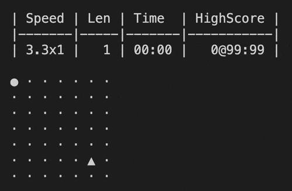

# Intro
- A text-based minimal snake game
- I'm trying **NOT** to find out if someone has already done it

# Design proposal
## 1) A config file to control the game parameters as many as possible
### &emsp;&emsp;1.1) The config file should be auto-generated if not exist
### &emsp;&emsp;1.2) The config file should be in TOML format (cuz why not?!)
## 2) Game parameters
### &emsp;&emsp;2.1) Gameplay
#### &emsp;&emsp;&emsp;&emsp;2.1.1) starting length of the snake
#### &emsp;&emsp;&emsp;&emsp;2.1.2) can go through the wall
#### &emsp;&emsp;&emsp;&emsp;2.1.3) (optional) add temporary objective
#### &emsp;&emsp;&emsp;&emsp;2.1.4) useLevel
### &emsp;&emsp;2.2) GameplaySpeed
#### &emsp;&emsp;&emsp;&emsp;2.2.1) Starting Speed
#### &emsp;&emsp;&emsp;&emsp;2.2.2) use levels to boost speed
#### &emsp;&emsp;&emsp;&emsp;2.2.3) motor type (ByKey, ByTimer, ByBoth)
#### &emsp;&emsp;&emsp;&emsp;2.2.4) (optional) speed boost for temporary objective
### &emsp;&emsp;2.3) GameplayLevel
#### &emsp;&emsp;&emsp;&emsp;2.3.1) LevelSpeedDefinition
#### &emsp;&emsp;&emsp;&emsp;2.3.2) Threshold
#### &emsp;&emsp;&emsp;&emsp;2.3.3) DefaultLevel
### &emsp;&emsp;2.4) Visual
#### &emsp;&emsp;&emsp;&emsp;2.4.1) show/ hide dashboard
#### &emsp;&emsp;&emsp;&emsp;2.4.2) show/ hide border
### &emsp;&emsp;2.5) VisualMap
#### &emsp;&emsp;&emsp;&emsp;2.5.1) size of map (must be square)
#### &emsp;&emsp;&emsp;&emsp;2.5.2) map legend (game unit and tile definition)
## 3) Game rules
### &emsp;&emsp;3.1) game start on the first key stroke
### &emsp;&emsp;3.2) game level up by eating items
### &emsp;&emsp;3.3) snake grows up by eating items
### &emsp;&emsp;3.4) the only score is the length of the snake
#### &emsp;&emsp;&emsp;&emsp;3.4.1) **NO PLANS** to implement complex score
### &emsp;&emsp;3.5) dashboard fields: Level, Speed, Length, Time, HighScore
### &emsp;&emsp;3.6) definite level and speed booster
### &emsp;&emsp;3.7) game end on win/ loss condition
### &emsp;&emsp;3.8) user can start a new game after defeated
### &emsp;&emsp;3.9) (optional) add win/ loss indicator
## 4) Code implementation
### &emsp;&emsp;4.1) the map should be a simple 2d array
### &emsp;&emsp;4.2) code should be as simple as possible
#### &emsp;&emsp;&emsp;&emsp;4.2.1) (optional) split Snake into smaller pieces
### &emsp;&emsp;4.3) **NO PLANS** to run TDD or DDD
### &emsp;&emsp;4.4) thread usage as less as possible
#### &emsp;&emsp;&emsp;&emsp;4.4.1) should be easy to extend to multi-thread
### &emsp;&emsp;4.5) should use dependency injection
### &emsp;&emsp;4.6) configuration should be strongly typed
### &emsp;&emsp;&emsp;&emsp;4.6.1) should be auto-mapped
### &emsp;&emsp;&emsp;&emsp;4.6.2) should support hot-reload
### &emsp;&emsp;4.7) use latest language features if possible
#### &emsp;&emsp;&emsp;&emsp;4.7.1) (optional) replace 2d array by jagged array to use indices
### &emsp;&emsp;4.8) **NO PLANS** to improve the text rendering experience
#### &emsp;&emsp;&emsp;&emsp;4.8.1) border should be rendered contiguously
#### &emsp;&emsp;&emsp;&emsp;4.8.2) handle half-width, full-width char gracefully
#### &emsp;&emsp;&emsp;&emsp;4.8.3) support colors
#### &emsp;&emsp;&emsp;&emsp;4.8.4) reduce flickers
## 5) Code deployment
### &emsp;&emsp;5.1) no test coverage
### &emsp;&emsp;5.2) no CI/ CD
### &emsp;&emsp;5.3) no docker
### &emsp;&emsp;5.4) no cloud
